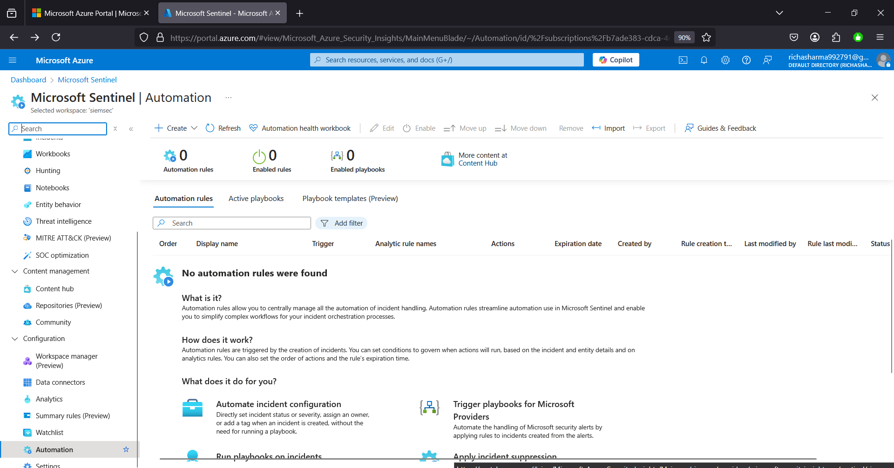
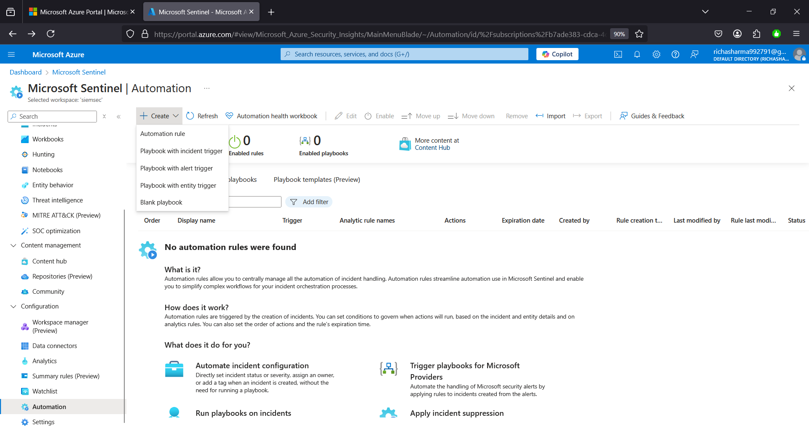

# ChatGPT Integration with Microsoft Sentinel

Welcome to the **ChatGPT Integration with Microsoft Sentinel** project! My name is **Sanchit Gangwar** This project demonstrates how to leverage ChatGPT within Microsoft Sentinel to automate incident analysis, generate remediation suggestions, and enhance your security operations. By integrating an AI language model into Sentinel’s playbooks, security teams can receive dynamic, context-aware responses to security incidents in near real time.

---

## Project Overview

In this project, I  integrate ChatGPT with Microsoft Sentinel using Azure Logic Apps to create a playbook that automates incident response tasks. The key steps include:

1. **Setting up Microsoft Sentinel**: Deploying Sentinel from an all-in-one GitHub solution.
2. **Creating a Playbook**: Developing a playbook named **ChatGPT** in the resource group `siemsec`.
3. **Logic App Designer Workflow**:
   - Triggered by a Microsoft Sentinel incident.
   - Incorporates a ChatGPT action by searching for **"ChatGPT 3 complete your prompt"**.
   - Configures dynamic parameters (incident title, description, ARM ID, comment message) to personalize the ChatGPT prompt.
4. **Automation Rule**: An automation rule is created so that the playbook automatically triggers when an incident is generated.
5. **Testing & Validation**: Incidents are simulated to verify that the playbook runs as expected and ChatGPT provides remediation guidance.

This integration empowers security operations by:
- **Enhancing Threat Detection**: ChatGPT analyzes incident details and correlates related information.
- **Automating Remediation**: Provides actionable insights on how to address security incidents.
- **Streamlining Workflows**: Reduces manual intervention by automating response tasks.

---

## Prerequisites

Before setting up the project, ensure you have the following:

- **Microsoft Azure Subscription**: Access to the Azure portal with sufficient permissions to deploy Microsoft Sentinel and create Logic Apps.
- **Microsoft Sentinel Instance**: Already deployed using the all-in-one solution from GitHub.
- **Resource Group**: A dedicated resource group (e.g., `siemsec`) where the playbook and related resources will reside.
- **OpenAI API Key**: Obtain a secret API key from [OpenAI’s API platform](https://platform.openai.com/api-keys). You will use this to authenticate the ChatGPT action in your playbook.
- **Basic Familiarity with Azure Logic Apps**: Understanding how to create and manage playbooks in Microsoft Sentinel.

## Setup & Configuration

### Creating the Playbook

1. **Deploy Microsoft Sentinel**:  
   - Start by setting up Microsoft Sentinel using the all-in-one solution available on GitHub https://github.com/Azure/Azure-Sentinel/tree/master/Tools/Sentinel-All-In-One.  
   - Once deployed, navigate to the Microsoft Sentinel workspace in the Azure portal.

2. **Access the Automation Section**:  
   - In the Microsoft Sentinel workspace, click on **Automation** from the left-hand menu.
   - Click **Create** to initiate a new playbook.

3. **Playbook Details**:  
   - Provide the required information, and name the playbook **ChatGPT**.
   - Ensure that the playbook is linked to the resource group (e.g., `siemsec`).

4. **Save and Deploy the Playbook**:  
   - Once all details are entered, click **Create Playbook** to deploy it.

---

### Configuring the Logic App Designer

1. **Open the Logic App Designer**:  
   - After the playbook is created, navigate to the **Logic App Designer** in the Azure portal.
   - In the designer, select the **Microsoft Sentinel Incident** trigger to ensure the playbook starts upon incident creation.

2. **Add ChatGPT Action**:  
   - Click on **New Step** and search for the ChatGPT action labeled **"ChatGPT 3 complete your prompt"**.
   - Configure this action by providing a connection name (e.g., `chatgpt`) and the OpenAI API key.  
     > **Note:** Obtain the API key from https://platform.openai.com/api-keys and input it into the API key field.

3. **Dynamic Content Integration**:  
   - In the prompt field of the ChatGPT action, use dynamic content to insert incident details:
     - **Incident Title & Description**: Insert the dynamic content for the incident title and description.
     - **Incident ARM ID**: Map the dynamic content field for the incident ARM ID.
     - **Incident Comment Message**: Use dynamic content to create a personalized message for the incident comment.
### Creating an Automation Rule

1. **Access the Automation Rule Settings**:  
   - In Microsoft Sentinel, navigate to the **Automation** section and choose to create a new automation rule.
   
2. **Define the Automation Rule**:  
   - **Rule Name**: Provide a descriptive name for the automation rule.
   - **Trigger Input**: Select **When incident is created** as the trigger condition.
   - **Action Input**: Under the action field, choose **Run playbook** and select the **ChatGPT** playbook that you just created.
   
3. **Save and Enable**:  
   - Save the automation rule. Once saved, the rule ensures that every new incident automatically triggers the ChatGPT playbook.

---

### Testing & Validation

- **Incident Simulation**:  
  - Create a test incident in Microsoft Sentinel to verify that the automation rule works correctly.
  - Observe that the playbook is triggered automatically, and a log entry is added to the incident's activity log.
  
- **Review Logs**:  
  - Confirm that the playbook executed as expected by reviewing the logs in the incident activity section.
  - Ensure that ChatGPT’s output is recorded as a comment on the incident, providing the recommended remediation steps.

---

---

## Usage & Daily Operations

### Operating the Integrated Solution

- **Incident Detection & Automated Response**:  
  When Microsoft Sentinel detects an incident, the automation rule immediately triggers the **ChatGPT** playbook. ChatGPT analyzes the incident data—using details like the incident title, description, and ARM ID—and generates a contextual response. This response is then automatically added as a comment to the incident, providing actionable remediation suggestions.  
  - **Placeholder for Screenshot**:  
    > _[Insert screenshot showing an incident with ChatGPT-generated comment in the activity log]_

- **Reviewing Playbook Outputs**:  
  Security analysts can review the output generated by ChatGPT directly in the incident activity log. This offers quick insights into the threat's nature and recommended steps for containment or remediation.

### Troubleshooting and Best Practices

- **Common Issues and Resolutions**:  
  - **API Connection Errors**: Ensure that the OpenAI API key is correctly configured and that the authentication scheme (e.g., including the “Bearer” prefix) is properly applied.  
  - **Dynamic Content Misconfiguration**: Double-check that all dynamic fields (incident title, description, ARM ID) are correctly mapped to the ChatGPT prompt to avoid generating generic responses.  
  - **Logic App Execution Failures**: Review error details in the run history. Microsoft’s documentation on [Logic Apps troubleshooting](https://learn.microsoft.com/en-us/azure/logic-apps/logic-apps-troubleshoot-common-issues) provides further insights.

- **Documentation & Versioning**:  
  - Maintain versioning for your playbook to track changes and updates over time. Use semantic versioning (e.g., 1.0.0, 1.1.0) for clarity.
  - Document any modifications or customizations in this README file and in separate release notes as needed.

## Final Notes

- **Integration Benefits**:  
  Integrating ChatGPT with Microsoft Sentinel streamlines incident analysis, enhances threat detection, and automates remediation processes. This solution minimizes manual intervention and improves overall SOC efficiency.
  
- **Future Enhancements**:  
  Consider integrating additional data sources or refining the ChatGPT prompt to include more advanced threat intelligence. This can further enhance the contextual accuracy of the responses provided.

- **References**:  
  - [Microsoft Sentinel Documentation](https://learn.microsoft.com/en-us/azure/sentinel/)  
  - [Automate response with playbooks in Sentinel](https://learn.microsoft.com/en-us/azure/sentinel/automate-response-playbooks)  
  - [Azure Logic Apps Documentation](https://learn.microsoft.com/en-us/azure/logic-apps/)  
  - [Monitor Logic Apps](https://learn.microsoft.com/en-us/azure/logic-apps/logic-apps-monitor-your-logic-apps)  
  - [Investigate incidents in Microsoft Sentinel](https://learn.microsoft.com/en-us/azure/sentinel/investigate-incidents)

## Additional Resources

For further reading and support, please refer to the following Microsoft resources:

- **Microsoft Sentinel Documentation**:  
  [Microsoft Sentinel](https://learn.microsoft.com/en-us/azure/sentinel/)
  
- **Playbooks and Automation in Sentinel**:  
  [Automate response with playbooks in Sentinel](https://learn.microsoft.com/en-us/azure/sentinel/automate-response-playbooks)
  
- **Azure Logic Apps Overview**:  
  [Azure Logic Apps Documentation](https://learn.microsoft.com/en-us/azure/logic-apps/)
  
- **Monitoring and Troubleshooting Logic Apps**:  
  [Monitor Logic Apps](https://learn.microsoft.com/en-us/azure/logic-apps/logic-apps-monitor-your-logic-apps)
  
- **Incident Investigation in Sentinel**:  
  [Investigate incidents in Microsoft Sentinel](https://learn.microsoft.com/en-us/azure/sentinel/investigate-incidents)
  
- **Latest Updates in Sentinel**:  
  [What's new in Microsoft Sentinel](https://learn.microsoft.com/en-us/azure/sentinel/whats-new)

---

## Contributing

Contributions to improve this integration are welcome! If you have suggestions, bug fixes, or enhancements:
  
- **Submit Issues**: Please use the GitHub Issues section to report bugs or request features.
- **Pull Requests**: Contributions via pull requests are encouraged. Please adhere to the contribution guidelines and maintain versioning using semantic versioning (e.g., 1.0.0, 1.1.0).

Your collaboration helps make this project more robust and applicable to a wide range of security operations scenarios.

---

## Final Notes
 **Integration Benefits**: Integrating ChatGPT with Microsoft Sentinel streamlines incident analysis, enhances threat detection, and automates remediation. This significantly reduces manual efforts and increases the efficiency of security operations.
